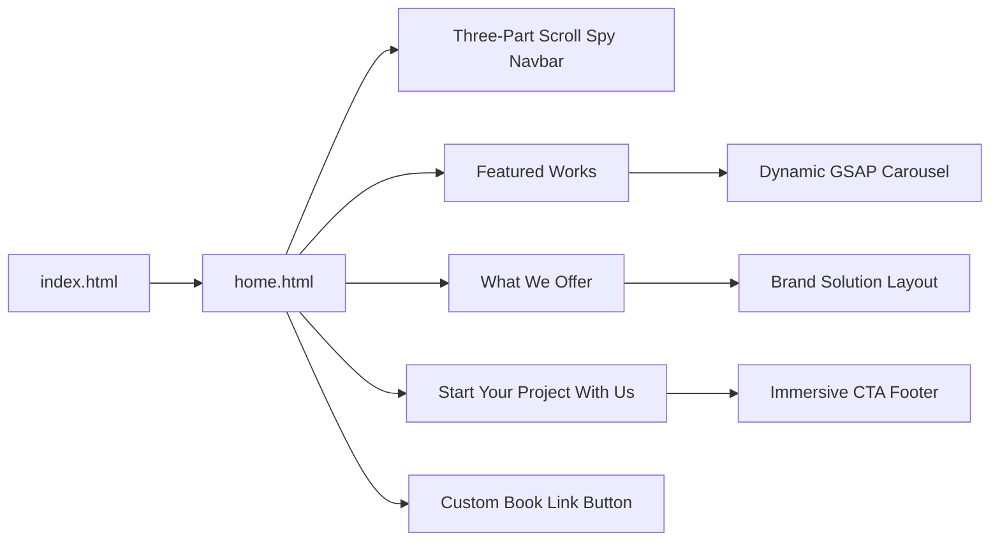
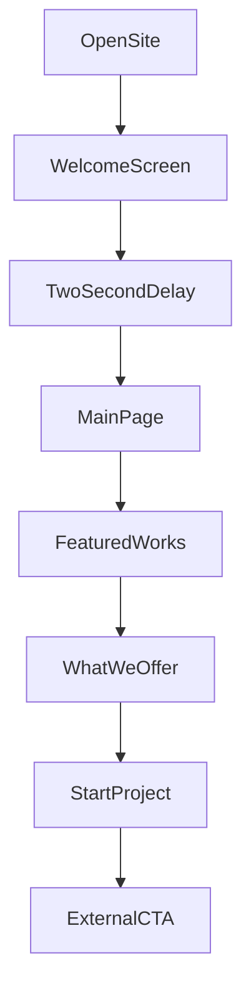
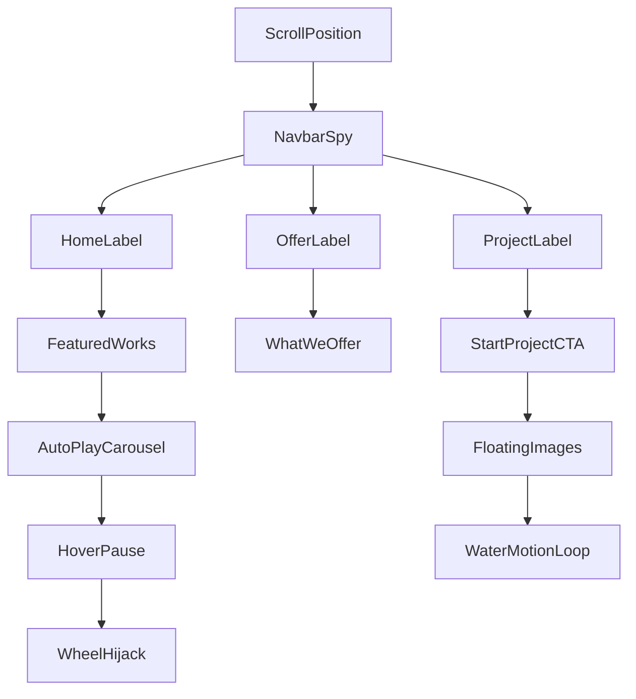

---

### 🌐 Live Demo
### [https://your-live-demo-link.com/](https://arsly001.netlify.app/)

For the code contact me or inbox me

------------------------------------------------------------------------

# 🧠 Project Overview

**ARSLY** is a premium animated portfolio and creative studio landing page designed with a dark cinematic interface, bold typography, smooth GSAP motion, and immersive visual storytelling.

The project focuses on presenting creative works, brand services, and project-starting calls to action through a highly interactive one-page experience.

**Tagline:** Your idea our effort

------------------------------------------------------------------------

# ⚡ Core Features

## 🎬 Premium Animated Experience

  Feature                  Description
  ------------------------ ------------------------------------------------
  🎯 Welcome Screen         Intro page with timed transition into the main site
  🧭 Scroll Spy Navbar      Three-part navigation that updates by active section
  🖼 Featured Carousel      Dynamic geometric work showcase with auto-play
  🛞 Wheel Interaction      Hover-based carousel wheel control
  ✨ GSAP Reveals           Scroll-triggered masked text and image animations
  🌊 Floating CTA Images    Water-like floating motion in the CTA section
  📗 Floating Book Button   Custom floating external-link button
  🖱 Custom Cursor          Dot and ring cursor with interactive hover states

------------------------------------------------------------------------

# 🧭 Site Architecture



------------------------------------------------------------------------

# 🏗 Tech Stack

### Frontend

-   HTML5
-   CSS3
-   Vanilla JavaScript

### Animation

-   GSAP Core
-   GSAP ScrollTrigger

### Typography

-   Bebas Neue
-   Syne
-   DM Sans

### Design System

-   Dark premium theme
-   Neon green accent `#c8ff00`
-   Geometric image clipping
-   Masked text reveal animation
-   Custom cursor interaction

------------------------------------------------------------------------

# 🔄 Page Flow



------------------------------------------------------------------------

# 🧩 Section Interaction



------------------------------------------------------------------------

# 🏠 Home / Featured Works

The Home section presents the main portfolio showcase.

Features:

-   Dynamic project cards generated from a JavaScript array
-   Auto-playing carousel
-   Hover pause interaction
-   Mouse wheel controlled navigation
-   Geometric `clip-path` image shapes
-   Floating title and pagination inside visual voids
-   Masked wave title reveal

------------------------------------------------------------------------

# 🧠 What We Offer

The What We Offer section presents the brand service identity of ARSLY.

Features:

-   Strong two-column split layout
-   Laser-style green line reveal
-   Large masked heading animation
-   Main image clip-path reveal
-   Service tags
-   View Services CTA button
-   Right-aligned brand strategy content
-   Supporting portfolio visuals

------------------------------------------------------------------------

# 🚀 Start Your Project With Us

The CTA section is designed to create a strong final conversion moment.

Features:

-   Large cinematic CTA heading
-   Smooth fade and blur reveal
-   Staggered masked word animation
-   Contact information block
-   Contact Us button
-   Background glowing orbs
-   Floating images with reflected glow
-   Water-like continuous motion loop

------------------------------------------------------------------------

# 📗 Floating Book Button

The site includes a custom floating button placed at the bottom-right corner.

Features:

-   Book icon inside a circular button
-   Light green gradient design
-   Animated glowing background
-   Hover scale effect
-   Tooltip label
-   External custom link support

------------------------------------------------------------------------

# 📂 Project Structure

    ARSLY
    │
    ├── index.html
    ├── home.html
    │
    ├── css
    │   └── styles.css
    │
    ├── js
    │   ├── common.js
    │   ├── welcome.js
    │   ├── home.js
    │   ├── offer.js
    │   └── cta.js
    │
    └── README.md

------------------------------------------------------------------------

# ⚙ Installation

Clone repository

```bash
git clone https://github.com/yourusername/ARSLY.git
```

Open project folder

```bash
cd ARSLY
```

Run locally using **VS Code Live Server**.

No npm installation is required because this is a pure static project.

```bash
# No build command needed
# No npm install needed
# Just open index.html with Live Server
```

------------------------------------------------------------------------

# 🌍 Deployment

This project can be deployed directly as a static website.

### Netlify Settings

```txt
Build command: leave empty
Publish directory: .
```

Make sure `index.html` stays in the root folder.

------------------------------------------------------------------------

# 🌟 Future Vision

-   Add project detail pages
-   Add real portfolio case studies
-   Add contact form integration
-   Add CMS-based project management
-   Add smooth page transitions
-   Add mobile-first responsive refinements
-   Add advanced WebGL or shader effects

------------------------------------------------------------------------

# 👨‍💻 Author

**Md Mahruf Alam**

Frontend Developer  
Creative Web Experience Builder  
GSAP Animation Enthusiast  
Problem Solver

------------------------------------------------------------------------

⭐ If you like the project, give it a star!
